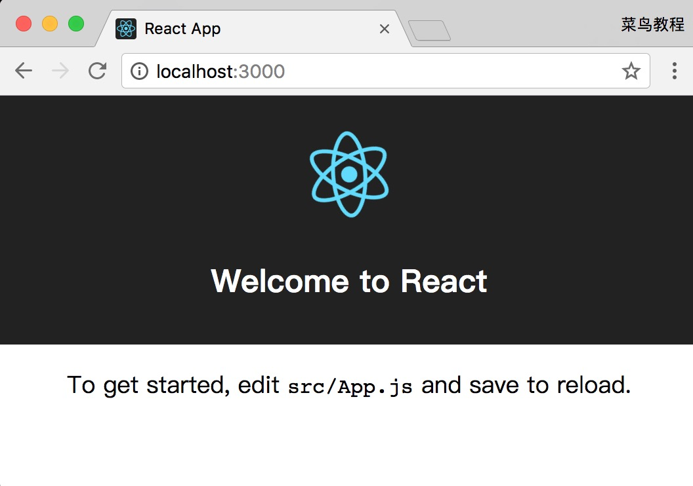
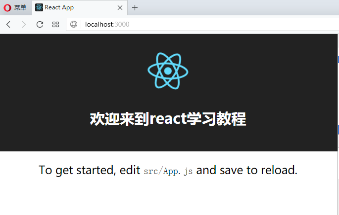
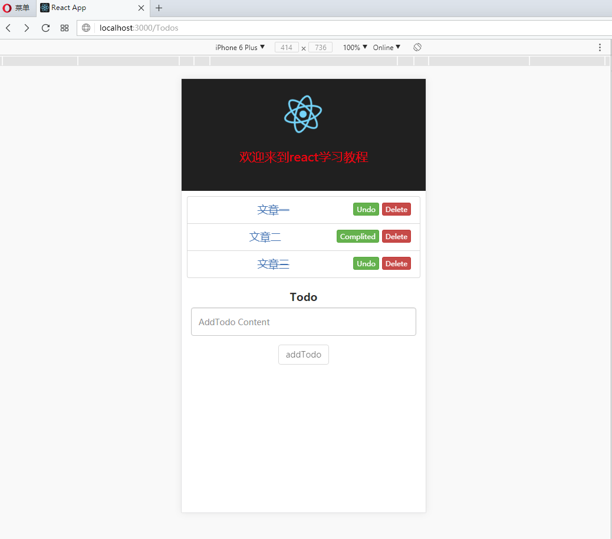
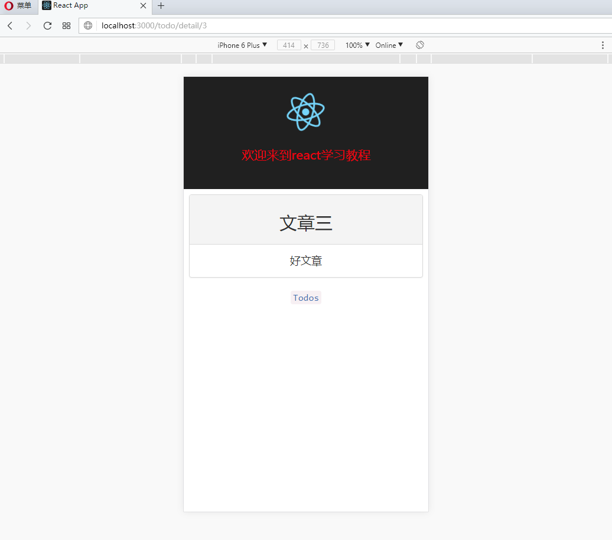
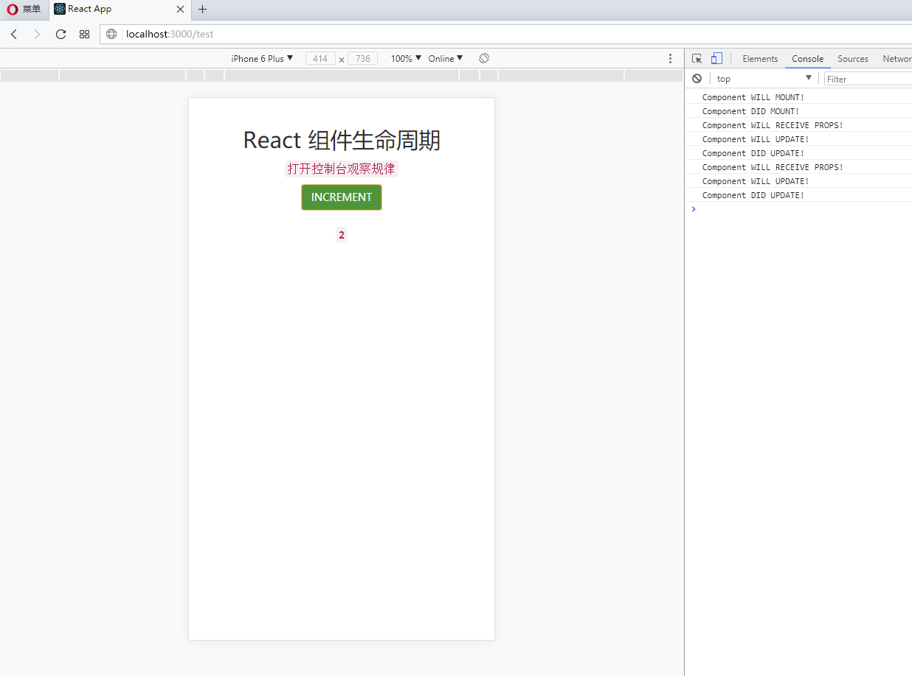

# React 新手入门学习教程 #

# 1. 预备知识 #
	
- HTML5
- CSS
- JavaScript
- ES6 常用语法

# 2. 安装与配置 #

执行以下命令创建项目：

    npm install -g create-react-app    //安装环境
	create-react-app my-app    //创建应用 应用名称my-app 最好使用正确的路径

	cd my-app    //移动项目
	npm start  //开始使用

在浏览器中打开 http://localhost:3000/ ，结果如下图所示：

 
 
 
 
 
 
 
 
	
# 3. 目录结构 #
	my-app
	 |-- node_modules/     		//各个插件存放位置
	 |-- public/          		
	 |   |-- favicon.ico
	 |   |-- index.html         
	 |-- src/          			// 是源码文件，一般做开发就在这个文件夹。
	 |   |-- App.css
	 |   |-- App.js          	
	 |   |-- App.test.css
	 |   |-- index.css
	 |   |-- index.js
	 |   |-- logo.svg
	 |   |-- registerServiceWorker.js
	 |-- .gitignore
	 |-- package.json
	 |-- README.md
   
尝试修改 src/App.js 文件代码：

	import React, { Component } from 'react';
	import logo from './logo.svg';
	import './App.css';
	 
	class App extends Component {
	  render() {
	    return (
	      

	        

	          
	          <h2>欢迎来到react学习教程</h2>
	        

	        

	          你可以在 <code>src/App.js</code> 文件中修改。
	        

	      

	    );
	  }
	}
	 
	export default App;

修改后，打开 http://localhost:3000/ （一般自动刷新），输出结果如下：

# 4. `react-router`的引入与使用 #

&emsp;环境算是简单的安装了，但还有很多配置可以深入学习，这里不做进一步的写了。

**4.1 定义文件结构**

- 新建文件夹`src/assets/images/`,将src下的logo.svg移到`src/assets/images/`；`src/assets/`静态文件存放文件；
- 新建文件夹`src/components/`,将src下的App.js,App.css,App.test.js移到`src/components/`；`src/components/`组件存放文件，可以将公用的组件放到该文件；
- 新建文件夹`src/views/`,组件存放文件，以后的主战场，以后构造页面的组件都放到这里面；
- 新建文件夹`src/routes/`,路由存放文件；

**4.2 安装相关包**

&emsp;执行下面命令

	npm install --save-dev redux redux-thunk react-redux history qs react-router-dom whatwg-fetch

**4.3 新建文件src/routes/index.js**

	'use strict'
	import React from 'react';
	import {Router, Switch, Route} from 'react-router-dom';
	import {createBrowserHistory} from 'history';
	
	import App from '../components/App';
	
	const history = createBrowserHistory();
	
	const Routes = () => (
	    <Router history={history}>
	        <Switch>
	            <Route path="/" name="App" component={App} />
	        </Switch>
	    </Router>
	);
	
	export default Routes;

**4.4 修改/index.js为**

	import React from 'react';
	import ReactDOM from 'react-dom';
	
	import Routes from './routes';
	import './index.css';
	import registerServiceWorker from './registerServiceWorker';
	
	const App = () => {
	    return (
	        <Routes />
	    );
	}
	
	const render = () => { ReactDOM.render(<App />, document.getElementById('root')) };
	
	render();
	registerServiceWorker();
	

**4.5 重启服务，执行`npm start` (若装了yarn也可以yarn start) ，打开 http://localhost:3000/**

# 5. 快速上手，之TODOS实例 #

&emsp;接下来我们做一个增删改查；

&emsp;/public/index.html引入`<link rel="stylesheet" href="http://cdn.bootcss.com/bootstrap/3.3.7/css/bootstrap.min.css">`

&emsp;添加路由，修改src/routes/index.js为：

	import React from 'react';
	import {Router, Switch, Route} from 'react-router-dom';
	import {createBrowserHistory} from 'history';
	
	import App from '../components/App';
	import Todos from '../views/todo/list/Todos';
	import Todo from '../views/todo/detail/Todo';
	
	const history = createBrowserHistory();
	
	
	const Routes = () => (
	    <Router history={history}>
	        <Switch>
	            <Route path="/todos" name="Todos" component={Todos} />
	            <Route path="/todo/detail/:id" name="Todo" component={Todo} />
	            <Route path="/" name="App" component={App} />
	        </Switch>
	    </Router>
	);
	
	export default Routes;

**5.1 Todos列表**

&emsp;新建文件`public/data/Todos.json`、`src/views/todo/list/Todos.js`、`src/views/todo/list/Todos.css`、`src/views/todo/list/package.json`；

5.1.1 public/data/Todos.json

	[
	    {
	        "id": 1,
	        "title": "文章一",
	        "content": "好文章",
	        "complited": true
	    },
	    {
	        "id": 2,
	        "title": "文章二",
	        "content": "好文章",
	        "complited": false
	    },
	    {
	        "id": 3,
	        "title": "文章三",
	        "content": "好文章",
	        "complited": true
	    }
	]

5.1.2 src/views/todo/list/Todos.js

	import React, { Component } from 'react';
	import {Link} from 'react-router-dom';
	import logo from '../../../assets/images/logo.svg';
	import './Todos.css';
	import AddTodo from '../add/AddTodo';
	
	class Todos extends Component {
	  constructor(props){
	    super(props);
	    this.state = {
	      Todos: []
	    };
	    this.handleComplited = this.handleComplited.bind(this);
	    this.handleDel = this.handleDel.bind(this);
	    this.handleAddTodo = this.handleAddTodo.bind(this);
	  }
	
	  componentDidMount(){
	    fetch('/data/Todos.json',{
	      method:'GET',
	      headers:{'Content-Type':'application/json'}
	    }).then((response)=>{
	      // 是否请求成功
	      if(response.status >= 200 && response.status <= 300){
	        return response;
	      }else{
	        var error = new Error(response.statusText);
	        error.response = response;
	        throw error;
	      }
	    }).then((response)=>{
	      return response.json();
	    }).then((data)=>{
	      this.setState({Todos: data});
	    }).catch((error) => {
	      // 请求失败
	      console.log('Request failed',error);
	    });
	  }
	
	  // 完成Todo
	  handleComplited(todo,index){
	    let Todos = this.state.Todos;
	    Todos[index].complited = !Todos[index].complited;
	    this.setState({Todos: Todos});
	  }
	
	  // 删除Todo
	  handleDel(index){
	    let Todos = this.state.Todos;
	    Todos.splice(index,1);
	    this.setState({Todos: Todos});
	  }
	
	  // 增加Todo
	  handleAddTodo(newTodo){
	    let Todos = this.state.Todos;
	    Todos.push(newTodo);
	    this.setState({Todos: Todos});
	  }
	  
	  render() {
	    return (
	        

	          <Link to="/">
	            <header className="App-header">
	              
	              <h1 className="App-title">欢迎来到react学习教程</h1>
	            </header>
	          </Link>
	          

	              <ul className="list-group">
	                {
	                  this.state.Todos.map((item,index) => {
	                    return (
	                      <li className="list-group-item" key={index}>
	                        <Link to={`/todo/detail/${item.id}`} style={item.complited ? {textDecoration: 'line-through'} : {}}>
	                          {item.title}
	                        </Link>
	                        <button
	                            type="button"
	                            className="btn btn-xs btn-danger pull-right marginLeft5"
	                            onClick={() => {this.handleDel(index)}}
	                            > Delete
	                        </button>
	                        <button
	                            type="button"
	                            className="btn btn-xs btn-success pull-right marginLeft5"
	                            onClick={() => { this.handleComplited(item, index) }}
	                            > {item.complited ? 'Undo' : 'Complited'}
	                        </button>
	                      </li>
	                    );
	                  })
	                }
	              </ul>
	              <AddTodo handleAddTodo={this.handleAddTodo} />
	          

	        

	    );
	  }
	}
	
	export default Todos;

5.1.3 src/views/todo/list/Todos.css
	
	*{
	    -webkit-box-sizing: content-box; 
	    -moz-box-sizing: content-box;
	    box-sizing: content-box; 
	}

	.Todos {
	    text-align: center;
	}

	.Todos .App-logo {
	    animation: App-logo-spin infinite 20s linear;
	    height: 80px;
	}

	.Todos .App-header {
	    background-color: #222;
	    height: 150px;
	    padding: 20px;
	    color: white;
	}

	.Todos .App-title {
	    font-size: 1.5em;
	    color:red;
	}

	.Todos .App-intro {
	    font-size: large;
	    padding:.5em;
	}

	.Todos .marginLeft5{
	    margin-left: .4em;
	}

	.Todos .list-group{
	    padding-left: 0px;
	}
	
	.Todos .todo-add{
	    width:90%;
	    margin:0 auto;
	}
	
	@keyframes App-logo-spin {
		from { transform: rotate(0deg); }
		to { transform: rotate(360deg); }
	}
	  

5.1.4 src/views/todo/list/package.json

	{
	  "name": "Todos",
	  "version": "0.0.0",
	  "private": true,
	  "main": "./Todos.js"
	}

**5.2 增加Todo**

&emsp;新建文件`src/views/todo/add/AddTodo.js`、`src/views/todo/add/AddTodo.css`、`src/views/todo/add/package.json`；

5.2.1 src/views/todo/add/AddTodo.js

	import React, { Component } from 'react';
	import './AddTodo.css';
	
	class AddTodo extends Component {
	  constructor(props){
	    super(props);
	    this.state = {
	      newTodo: {"id": null,"title": "","content": "","complited": false}
	    };
	    this.handleAdd = this.handleAdd.bind(this);
	    this.handleChange = this.handleChange.bind(this);
	    this.required = this.required.bind(this);
	  }
	
	  handleAdd(){
	    this.props.handleAddTodo(this.state.newTodo);
	    this.setState({newTodo: {"id": null,"title": "","content": "","complited": false}});
	  }
	
	  handleChange(e){
	    this.setState({newTodo:{"id": null,"title": e.target.value,"content": "","complited": false}});
	  }
	
	  required(){
	    return this.state.newTodo.title === '';
	  }
	
	  render() {
	    return (
	        

	          <form className="form" >
	            

	                <label htmlFor="firstname" className="control-label">Todo</label>
	                <input
	                    type="text"
	                    className="form-control todo-add"
	                    id="firstname"
	                    placeholder="AddTodo Content"
	                    value={this.state.newTodo.title}
	                    onChange={this.handleChange}
	                    autoComplete="off" />
	            

	            

	                <button
	                    type="button"
	                    className={this.required() ? 'btn btn-default' : 'btn btn-success'}
	                    onClick={this.handleAdd}
	                    disabled={this.required()}
	                     >addTodo
	                </button>
	            

	          </form>
	        

	    );
	  }
	}
	
	export default AddTodo;

5.2.2 src/views/todo/add/AddTodo.css

	.AddTodo .todo-add{
	  width:90%;
	  margin:0 auto;
	}

	.AddTodo .form-group{
	  text-align: center;
	}

5.2.3 src/views/todo/add/package.json

	{
	  "name": "AddTodo",
	  "version": "0.0.0",
	  "private": true,
	  "main": "./AddTodo.js"
	}

**5.3 Todo详情**

&emsp;新建文件`src/views/todo/detail/Todo.js`、`src/views/todo/detail/Todo.css`、`src/views/todo/detail/package.json`；

5.3.1 src/views/todo/detail/Todo.js

	import React, { Component } from 'react';
	import {Link} from 'react-router-dom';
	import logo from '../../../assets/images/logo.svg';
	import './Todo.css';
	
	class Todo extends Component {
	  constructor(props){
	    super(props);
	    this.state = {
	      Todo:{},
	    };
	  }
	
	  componentDidMount(){
	    // 请求数据
	    fetch('/data/Todos.json',{
	      method:'GET',
	      headers:{'Content-Type':'application/json'}
	    }).then((response)=>{
	      // 是否请求成功
	      if(response.status >= 200 && response.status <= 300){
	        return response;
	      }else{
	        var error = new Error(response.statusText);
	        error.response = response;
	        throw error;
	      }
	    }).then((response)=>{
	      return response.json();
	    }).then((data)=>{
	      if(data){
	        let id = Number(this.props.match.params.id)
	        let Todo = {};
	        data.map((item,index) => {
	          if(item.id === id){
	            Todo = item;
	          }
	          return Todo;
	        });
	        this.setState({Todo: Todo});
	      }else{
	        console.log('Request failed',data);
	      }
	      this.setState({Todos: data});
	    }).catch((error) => {
	      // 请求失败
	      console.log('Request failed',error);
	    });
	  }
	
	  render() {
	    return (
	      

	        <Link to="/" >
	            <header className="App-header">
	                
	                <h1 className="App-title">欢迎来到react学习教程</h1>
	            </header>
	        </Link>
	        

	            {this.state.Todo.id ?
	                

	                    

	                        <h2>{this.state.Todo.title}</h2>
	                    

	                    
{this.state.Todo.content}

	                

	                :
	                

	                    <h2>暂无数据</h2>
	                

	            }
	            <code><Link to="/Todos" >Todos</Link></code>
	        

	    

	    );
	  }
	}
	
	export default Todo;

5.3.2 src/views/todo/detail/Todo.css

	*{
	  -webkit-box-sizing: content-box; 
	  -moz-box-sizing: content-box;
	  box-sizing: content-box; 
	}

	.Todo {
	  text-align: center;
	}
	
	.Todo .App-logo {
	  animation: App-logo-spin infinite 20s linear;
	  height: 80px;
	}
	
	.Todo .App-header {
	  background-color: #222;
	  height: 150px;
	  padding: 20px;
	  color: white;
	}
	
	.Todo .App-title {
	  font-size: 1.5em;
	  color:red;
	}
	
	.Todo .App-intro {
	  font-size: large;
	  padding:.5em;
	}
	
	
	@keyframes App-logo-spin {
	  from { transform: rotate(0deg); }
	  to { transform: rotate(360deg); }
	}

5.3.3 src/views/todo/detail/package.json

	{
	  "name": "Todo",
	  "version": "0.0.0",
	  "private": true,
	  "main": "./Todo.js"
	}

在Todos列表点击文章标题，跳转到Todo详情页面：

# 6. `React` 组件生命周期。#

&emsp;组件的生命周期可分成三个状态：

- Mounting：已插入真实 DOM
- Updating：正在被重新渲染
- Unmounting：已移出真实 DOM

&emsp;生命周期的方法有：

- componentWillMount 在渲染前调用,在客户端也在服务端。

- componentDidMount : 在第一次渲染后调用，只在客户端。之后组件已经生成了对应的DOM结构，可以通过this.getDOMNode()来进行访问。 如果你想和其他JavaScript框架一起使用，可以在这个方法中调用setTimeout, setInterval或者发送AJAX请求等操作(防止异部操作阻塞UI)。

- componentWillReceiveProps 在组件接收到一个新的prop时被调用。这个方法在初始化render时不会被调用。

- shouldComponentUpdate 返回一个布尔值。在组件接收到新的props或者state时被调用。在初始化时或者使用forceUpdate时不被调用。 
可以在你确认不需要更新组件时使用。

- componentWillUpdate在组件接收到新的props或者state但还没有render时被调用。在初始化时不会被调用。

- componentDidUpdate 在组件完成更新后立即调用。在初始化时不会被调用。

- componentWillUnmount在组件从 DOM 中移除的时候立刻被调用。

**6.1 生命周期**

6.1.1 新建文件src/views/test/Test.js

	import React, { Component } from 'react';
	import './Test.css';
	
	const Button = ({setNewNumber}) => {
	  return (
	    <button
	      type="button"
	      className="btn btn-success"
	      onClick={() => {setNewNumber();}}
	      >INCREMENT
	    </button>
	  )
	}
	
	class Content extends Component {
	
	  componentWillMount() {
	    console.log('Component WILL MOUNT!')
	  }
	  componentDidMount() {
	    console.log('Component DID MOUNT!')
	  }
	  componentWillReceiveProps(newProps) {
	    console.log('Component WILL RECEIVE PROPS!')
	  }
	  shouldComponentUpdate(newProps, newState) {
	    return true;
	  }
	  componentWillUpdate(nextProps, nextState) {
	    console.log('Component WILL UPDATE!')
	  }
	  componentDidUpdate(prevProps, prevState) {
	    console.log('Component DID UPDATE!')
	  }
	  componentWillUnmount() {
	    console.log('Component WILL UNMOUNT!')
	  }
	
	  render() {
	    return (
	      

	        <code>{this.props.data}</code>
	      

	    );
	  }
	  
	}
	
	class Test extends Component {
	  constructor(props){
	    super(props);
	    this.state = {
	      data: 0
	    };
	    this.setNewNumber = this.setNewNumber.bind(this);
	  }
	
	  setNewNumber(){
	    this.setState({data: this.state.data + 1});
	  }
	  
	  render() {
	    return (
	        

	          <h2>React 组件生命周期</h2>
	          
<code>打开控制台观察规律</code>

	          <Button setNewNumber={this.setNewNumber}/>
	          <Content data={this.state.data}/>
	        

	    );
	  }
	}
	
	export default Test;

6.1.2 新建文件src/views/test/Test.css

	.test {
	    text-align: center;
	    padding:40px;
	}
	.test .code {
	    margin-top:20px;
	    font-size: 17px;
	    font-weight: bold;
	}
	.test h2{
	    margin-top:0px;
	    margin-bottom: 10px;
	}
	.test p {
	    font-size: large;
	}

6.1.3 添加路由，修改文件src/routes/index.js为：

	import React from 'react';
	import {Router, Switch, Route} from 'react-router-dom';
	import {createBrowserHistory} from 'history';
	
	import App from '../components/App';
	import Todos from '../views/todo/list/Todos';
	import Todo from '../views/todo/detail/Todo';
	import Test from '../views/test/Test';
	
	const history = createBrowserHistory();
	
	
	const Routes = () => (
	    <Router history={history}>
	        <Switch>
	            <Route path="/todos" name="Todos" component={Todos} />
	            <Route path="/todo/detail/:id" name="Todo" component={Todo} />
	            <Route path="/test" name="Test" component={Test} />
	            <Route path="/" name="App" component={App} />
	        </Switch>
	    </Router>
	);
	
	export default Routes;

6.1.4 在浏览器中打开 http://localhost:3000/test，打开控制台观察规律，结果如下图所示：

# 7. `react-redux` 的使用。#

&emsp;`react-redux` 只是项目的一个可选项，到底选择要不要使用它根据你的项目而定。

&emsp;`react-redux` 出现场景：

- 在react里面，想要从子组件中修改某个值，必须通过改变父组件的这个值，然后父组件的值改变后，会自动重新渲染数据到本身和所有子组件中去。

- 当你的组件嵌套的不深的情况下：

&emsp;&emsp; 如：父组件 > 子组件；这时的组件层次就两层，想要从子组件中修改某个值，通过改变父组件的这个值也很容易操作。

- 当你的组件嵌套的很深的情况下：

&emsp;&emsp; 如：父组件 > 子组件 > 子子组件 > 子子子组件 ......；

&emsp;&emsp; 我们都知道在react里面，组件之间的传值方式是: 父组件 > 子组件 > 子子组件 > 子子子组件 ......

&emsp;&emsp; 我们想要在子组件中修改某个值也需要一层一层往上去修改父组件的值来重新渲染：  ...... 子子子组件 > 子子组件 > 子组件 > 父组件

&emsp;&emsp; 这时层级这么深，操作起来太麻烦了，有没有一种方式，我可以跳过这层层组件，直接修改值然后该层级的所有组件中的这个值就被我修改了。答案是：有，他就是react-redux。

**接下来，我们接着通过引用 `react-redux` 对上面的项目进行改造，对上面的Todos进行重构，(在上面的4.2中我们已经安装了 `redux`,`redux-thunk`,`react-redux` ，没有安装的，自己安装)**

**7.1 引入 `react-redux` 与配置**

7.1.1 新建文件src/reducers/todoReducer.js

	export const initialState = {
	    Todos: []
	};
	
	export default (state = initialState, action) => {
	    switch (action.type) {
	        case 'TODO_LIST': {
	            const data = action.payload;
	            return {
	                ...state,
	                ...data
	            }
	        }
	        default:
	            return state;
	    }
	};

7.1.2 新建文件src/reducers/index.js

	import {combineReducers} from 'redux';
	import todoReducer from './todoReducer';
	
	const reducers = combineReducers({
	    todo: todoReducer
	});
	
	export default reducers;

7.1.3 新建文件src/store/index.js

	import { createStore, applyMiddleware } from 'redux';
	import ReduxThunk from 'redux-thunk';// 中间件，有了这个就可以支持异步action
	import RootReducer from '../reducers';// 所有的reducer
	
	// 创建store
	const store = createStore(RootReducer, applyMiddleware(ReduxThunk));
	
	export default store;

7.1.4 修改/index.js为：

	import React from 'react';
	import ReactDOM from 'react-dom';
	import {Provider} from 'react-redux';
	
	import Routes from './routes';
	import store from './store';
	import './index.css';
	import registerServiceWorker from './registerServiceWorker';
	
	const App = () => {
	    return (
	        <Provider store={store}>
	            <Routes />
	        </Provider>
	    );
	}
	
	const render = () => { ReactDOM.render(<App />, document.getElementById('root')) };
	
	render();
	registerServiceWorker();

**7.2 重构Todos列表为**

7.2.1 修改src/views/todo/list/Todos.js为：

	import React, { Component } from 'react';
	import {Link} from 'react-router-dom';
	import {connect} from 'react-redux';
	import logo from '../../../assets/images/logo.svg';
	import './Todos.css';
	import AddTodo from '../add/AddTodo';
	
	class Todos extends Component {
	  constructor(props){
	    super(props);
	    // this.state = {
	    //   Todos: []
	    // };
	    this.handleComplited = this.handleComplited.bind(this);
	    this.handleDel = this.handleDel.bind(this);
	    // this.handleAddTodo = this.handleAddTodo.bind(this);
	  }
	
	  componentDidMount(){
	    fetch('/data/Todos.json',{
	      method:'GET',
	      headers:{'Content-Type':'application/json'}
	    }).then((response)=>{
	      // 是否请求成功
	      if(response.status >= 200 && response.status <= 300){
	        return response;
	      }else{
	        var error = new Error(response.statusText);
	        error.response = response;
	        throw error;
	      }
	    }).then((response)=>{
	      return response.json();
	    }).then((data)=>{
	      // this.setState({Todos: data});
	      this.props.setTodos({Todos: data});
	    }).catch((error) => {
	      // 请求失败
	      console.log('Request failed',error);
	    });
	  }
	
	  // 完成Todo
	  handleComplited(index){
	    let Todos = this.props.Todos;
	    Todos[index].complited = !Todos[index].complited;
	    this.props.setTodos({Todos:[...Todos]});
	  }
	
	  // 删除Todo
	  handleDel(index){
	    let Todos = this.props.Todos;
	    Todos.splice(index,1);
	    this.props.setTodos({Todos:[...Todos]});
	  }
	
	  // // 增加Todo
	  // handleAddTodo(newTodo){
	  //   let Todos = this.props.Todos;
	  //   Todos.push(newTodo);
	  //   this.props.setTodos({Todos:[...Todos]});
	  // }
	  
	  render() {
	    const {Todos} = this.props;
	    return (
	        

	          <Link to="/">
	            <header className="App-header">
	              
	              <h1 className="App-title">欢迎来到react学习教程</h1>
	            </header>
	          </Link>
	          

	              <ul className="list-group">
	                {
	                  Todos.map((item,index) => {
	                    return (
	                      <li className="list-group-item" key={index}>
	                        <Link to={`/todo/detail/${item.id}`} style={item.complited ? {textDecoration: 'line-through'} : {}}>
	                          {item.title}
	                        </Link>
	                        <button
	                            type="button"
	                            className="btn btn-xs btn-danger pull-right marginLeft5"
	                            onClick={() => {this.handleDel(index)}}
	                            > Delete
	                        </button>
	                        <button
	                            type="button"
	                            className="btn btn-xs btn-success pull-right marginLeft5"
	                            onClick={() => { this.handleComplited(index) }}
	                            > {item.complited ? 'Undo' : 'Complited'}
	                        </button>
	                      </li>
	                    );
	                  })
	                }
	              </ul>
	              {/* <AddTodo handleAddTodo={this.handleAddTodo} /> */}
	              <AddTodo/>
	          

	        

	    );
	  }
	}
	
	function mapStateToProps(state, ownProps) {
	  return {
	    Todos: state.todo.Todos
	  }
	}
	function mapDispatchToProps(dispatch, ownProps) {
	  return {
	    setTodos: (data) => dispatch({type: 'TODO_LIST', payload: data}),
	  }
	}
	export default connect(mapStateToProps, mapDispatchToProps)(Todos);

**7.3 重构增加Todo**

7.3.1 修改src/views/todo/add/AddTodo.js为：

	import React, { Component } from 'react';
	import {connect} from 'react-redux';
	import './AddTodo.css';
	
	const newTodo = {"id": null,"title": "","content": "","complited": false};
	
	class AddTodo extends Component {
	  constructor(props){
	    super(props);
	    this.state = {
	      newTodo: newTodo
	    };
	    // this.handleAdd = this.handleAdd.bind(this);
	    this.handleAddTodo = this.handleAddTodo.bind(this);
	    this.handleChange = this.handleChange.bind(this);
	    this.required = this.required.bind(this);
	  }
	
	  // 增加Todo
	  handleAddTodo(){
	    let Todos = this.props.Todos;
	    Todos.push(this.state.newTodo);
	    this.props.setTodos({Todos: [...Todos]});
	    this.setState({newTodo: newTodo})
	  }
	
	  // handleAdd(){
	  //   this.props.handleAddTodo(this.state.newTodo);
	  //   this.setState({newTodo: {"id": null,"title": "","content": "","complited": false}});
	  // }
	
	  handleChange(e){
	    this.setState({newTodo:{"id": null,"title": e.target.value,"content": "","complited": false}});
	  }
	
	  required(){
	    return this.state.newTodo.title === '';
	  }
	
	  render() {
	    return (
	        

	          <form className="form" >
	            

	                <label htmlFor="firstname" className="control-label">Todo</label>
	                <input
	                    type="text"
	                    className="form-control todo-add"
	                    id="firstname"
	                    placeholder="AddTodo Content"
	                    value={this.state.newTodo.title}
	                    onChange={this.handleChange}
	                    autoComplete="off" />
	            

	            

	                <button
	                    type="button"
	                    className={this.required() ? 'btn btn-default' : 'btn btn-success'}
	                    onClick={this.handleAddTodo}
	                    disabled={this.required()}
	                     >addTodo
	                </button>
	            

	          </form>
	        

	    );
	  }
	}
	
	function mapStateToProps(state, ownProps) {
	  return {
	    Todos: state.todo.Todos
	  }
	}
	
	function mapDispatchToProps(dispatch, ownProps) {
	  return {
	    setTodos: (data) => dispatch({type: 'TODO_LIST', payload: data}),
	  }
	}
	
	export default connect(mapStateToProps,mapDispatchToProps)(AddTodo);

**7.4 重构Todo详情**

7.4.1 修改src/views/todo/detail/Todo.js为：

	import React, { Component } from 'react';
	import {Link} from 'react-router-dom';
	import {connect} from 'react-redux';
	import logo from '../../../assets/images/logo.svg';
	import './Todo.css';
	
	class Todo extends Component {
	  constructor(props){
	    super(props);
	    this.state = {
	      Todo:{},
	    };
	  }
	
	  componentDidMount(){
	
	    // // 请求数据
	    // fetch('/data/Todos.json',{
	    //   method:'GET',
	    //   headers:{'Content-Type':'application/json'}
	    // }).then((response)=>{
	    //   // 是否请求成功
	    //   if(response.status >= 200 && response.status <= 300){
	    //     return response;
	    //   }else{
	    //     var error = new Error(response.statusText);
	    //     error.response = response;
	    //     throw error;
	    //   }
	    // }).then((response)=>{
	    //   return response.json();
	    // }).then((data)=>{
	    //   if(data){
	    //     let id = Number(this.props.match.params.id)
	    //     let Todo = {};
	    //     data.map((item,index) => {
	    //       if(item.id === id){
	    //         Todo = item;
	    //       }
	    //       return Todo;
	    //     });
	    //     this.setState({Todo: Todo});
	    //   }else{
	    //     console.log('Request failed',data);
	    //   }
	    //   this.setState({Todos: data});
	    // }).catch((error) => {
	    //   // 请求失败
	    //   console.log('Request failed',error);
	    // });
	
	    let id = Number(this.props.match.params.id)
	    let Todo = {};
	    const {Todos} = this.props;
	    Todos.map((item,index) => {
	      if(item.id === id){
	        Todo = item;
	      }
	      return Todo;
	    });
	    this.setState({Todo: Todo});
	  }
	
	  render() {
	    return (
	      

	        <Link to="/" >
	            <header className="App-header">
	                
	                <h1 className="App-title">欢迎来到react学习教程</h1>
	            </header>
	        </Link>
	        

	            {this.state.Todo.id ?
	                

	                    

	                        <h2>{this.state.Todo.title}</h2>
	                    

	                    
{this.state.Todo.content}

	                

	                :
	                

	                    <h2>暂无数据</h2>
	                

	            }
	            <code><Link to="/Todos" >Todos</Link></code>
	        

	    

	    );
	  }
	}
	
	function mapStateToProps(state, ownProps) {
	  return {
	    Todos: state.todo.Todos
	  }
	}
	
	export default connect(mapStateToProps)(Todo);

 
 
 
 
 
 
 
 
 
 
 
 

